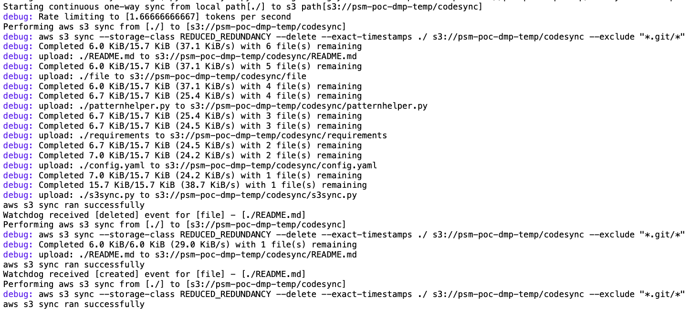
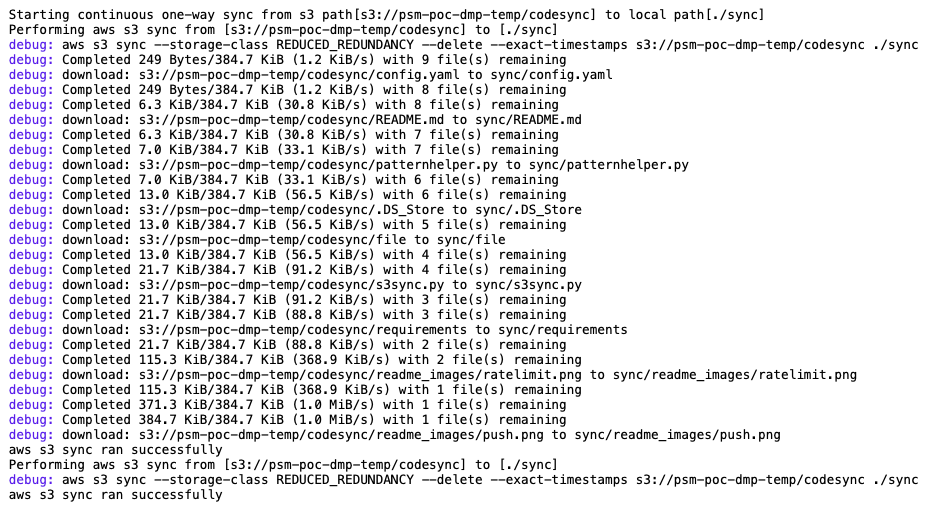
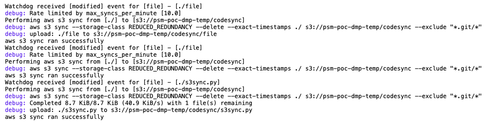

# s3sync

[](https://pypi.org/project/pys3sync)
[](https://pypi.org/project/pys3sync)

<!--ts-->
   * [Overview](#overview)
   * [Features](#features)
   * [Requirements](#requirements)
   * [Installation](#installation)
   * [Usage](#usage)
       * [First run/setup](#first-runsetup)
       * [Push](#push)
       * [Pull](#pull)
       * [Rate limiting in action](#rate-limiting-in-action)
   * [Configuration](#configuration)
       * [Include/excluse patterns](#includeexcluse-patterns)
       * [Advanced Configuration](#advanced-configuration)
   * [Performance Tests for aws sync command](#performance-tests-for-aws-sync-command)
<!--te-->

### Overview

s3sync.py is a utility created to sync files to/from S3 as a continuously running process, without having to manually take care of managing the sync. It internally uses the `aws s3 sync` command to do the sync, and  uses the python module [watchdog](https://github.com/gorakhargosh/watchdog) to listen to filesystem events on the monitored path and push changes to S3. For pull, there is no listener implemented, and it does simple interval based pull. Therefore for pull it is recommended to use [s3fs](https://github.com/s3fs-fuse/s3fs-fuse) instead  - just mount the s3 bucket on your filesystem.

### Features

- Rate limiting using the python [tocken-bucket](https://github.com/falconry/token-bucket) module. You can set `max_syncs_per_minute` in the config yaml and the file system watcher triggered pushes will be throttled as per that limit.
- Optional Reporting of runtime stats for the sync operation using the [pyformance](https://github.com/omergertel/pyformance) module
- Ability to filter by `include_patterns`and `exclude_patterns` or to `exclude_directories` completely, or make the filter `case_sensitive`
- Automated setup of AWS CLI config by creating a separate [named profile](https://docs.aws.amazon.com/cli/latest/userguide/cli-configure-profiles.html) for the utility with ability to tune performance by setting `max_concurrent_requests`, `max_queue_size`, etc.
- Setuptools integration, python [click](https://click.palletsprojects.com/en/7.x/) based command line interface

### Requirements

Requires [AWS CLI version 2](https://docs.aws.amazon.com/cli/latest/userguide/cli-chap-install.html) to be installed and available in the path

### Installation

`pip install pys3sync`

### Usage

`s3sync --help`

```bash
Usage: s3sync.py [OPTIONS] COMMAND [ARGS]...

  A utility created to sync files to/from S3 as a continuously running
  process, without having to manually take care of managing the sync.  It
  internally uses the aws s3 sync command to do the sync and uses python's
  watchdog listener to get notified of any changes to the watched folder.

Options:
  --config PATH        Path to the config.yaml file containing configuration
                       params for this utility  [required]

  -v, --verbosity LVL  Either CRITICAL, ERROR, WARNING, INFO or DEBUG
  --help               Show this message and exit.

Commands:
  init  Initial setup.
  pull  One-way continuous sync from s3 path to local path (based on
        polling...

  push  One-way continuous sync from localpath to s3 path (uses a file...
```

`s3sync --config config.yaml push --help`

```bash
Usage: s3sync.py push [OPTIONS]

  One-way continuous sync from localpath to s3 path (uses a file watcher
  called watchdog)

Options:
  --s3path PATH     Full s3 path to sync to/from  [required]
  --localpath PATH  Local directory path which you want to sync  [required]
  --help            Show this message and exit.
```

`s3sync --config config.yaml push --help`

```bash
Usage: s3sync.py pull [OPTIONS]

  One-way continuous sync from s3 path to local path (based on polling on an
  interval)

Options:
  --s3path PATH       Full s3 path to sync to/from  [required]
  --localpath PATH    Local directory path which you want to sync  [required]
  --interval INTEGER  S3 polling interval in seconds  [required]
  --help              Show this message and exit.
```

##### First run/setup

`s3sync --config-yaml config.yaml init`

This utility creates a [named profile](https://docs.aws.amazon.com/cli/latest/userguide/cli-configure-profiles.html) for your AWS CLI so that the parameters required for the S3 cli for the utility are isolated from your regular AWS CLI profile. The first time you nee to run the `init` command, which will create the named profile `s3sync`  in your local aws config (`~/.aws/config`), with the parameters configured in `config.yaml` and credentials copied from your default AWS credentials file.

##### Push

You run one instance of this utility per localpath<>s3path combination that you want to continuously sync

`s3sync --config config.yaml -v DEBUG push --s3path s3://<bucket>/<path> --localpath ./` 



##### Pull

`s3sync --config config.yaml -v DEBUG pull --s3path s3://<bucket>/<path> --localpath ./sync --interval 2`



##### Rate limiting in action



### Configuration

```yaml
global:
  max_syncs_per_minute: 10
  report_stats: False
watcher:
  include_patterns: 
  exclude_patterns: ["*.git/*"]
  exclude_directories: False
  case_sensitive: False
s3:
  max_concurrent_requests: 20
  max_queue_size: 2000
  multipart_threshold: 8MB
  multipart_chunksize: 8MB
  max_bandwidth: 
  use_accelerate_endpoint: "false"
  region: ap-south-1
```

##### Include/excluse patterns

Include/excluse patterns are implemented using [pathtools.match_any_path](https://github.com/gorakhargosh/pathtools/blob/master/pathtools/patterns.py#L220), which ultimately supports unix glob pattern syntax. You can test your patterns using the provided script `patternhelper.py`. These patterns are passed to the watchdog as well as aws cli, which also uses the [same syntax](https://docs.aws.amazon.com/cli/latest/reference/s3/index.html#use-of-exclude-and-include-filters). Both properties accept a list of patterns.

##### Advanced Configuration

Please change these values carefully. They depend on your machine and your internet connection. Read more about improving s3 sync transfer speeds [here](https://aws.amazon.com/premiumsupport/knowledge-center/s3-improve-transfer-sync-command/)

###### max_concurrent_requests

Passed through to your `~/.aws/config` via `aws configure set default.s3.max_concurrent_requests` command. Read about the parameter [here](https://docs.aws.amazon.com/cli/latest/topic/s3-config.html#max-concurrent-requests)

###### max_queue_size

Passed through to your `~/.aws/config` via `aws configure set default.s3.max_queue_size` command. Read about the parameter [here](https://docs.aws.amazon.com/cli/latest/topic/s3-config.html#max-queue-size)

###### multipart_threshold

Passed through to your `~/.aws/config` via `aws configure set default.s3.multipart_threshold` command. Read about the parameter [here](https://docs.aws.amazon.com/cli/latest/topic/s3-config.html#multipart-threshold)

###### multipart_chunksize

Passed through to your `~/.aws/config` via `aws configure set default.s3.multipart_chunksize` command. Read about the parameter [here](https://docs.aws.amazon.com/cli/latest/topic/s3-config.html#multipart-chunksize)

###### max_bandwidth

Passed through to your `~/.aws/config` via `aws configure set default.s3.max_bandwidth` command. Read about the parameter [here](https://docs.aws.amazon.com/cli/latest/topic/s3-config.html#max-bandwidth)

###### use_accelerate_endpoint

Passed through to your `~/.aws/config` via `aws configure set default.s3.use_accelerate_endpoint` command. Read about the parameter [here](https://docs.aws.amazon.com/cli/latest/topic/s3-config.html#use-accelerate-endpoint)

------

### Performance Tests for aws sync command

#### Environment

> Network: home/BLR (Airtel 1 Gbps Xtreme Fiber)  
> WiFi: 5 GHZ, RSS: -38 dbM, Tx rate: 1300 Mbps (802.11 ac)  
> Upload speed to s3: 18 MB/s  
> Download speed from s3: 15 MB/s  
> Number of threads for s3 sync command: 10 (default)

#### Sync from local to S3 (upload)

##### Test artifact 1: https://github.com/apache/storm

Size: 224M  
Number of files: 3571

###### Test 1 (full sync):

```bash
time aws s3 sync --storage-class REDUCED_REDUNDANCY ./ s3://psm-poc-dmp-temp/codesync
real	0m45.543s
user	0m14.755s
sys	0m3.685s
```

###### Test 2 (added 39 files, 168k):

```bash
cp -rf ../intSDK .
time aws s3 sync --storage-class REDUCED_REDUNDANCY ./  s3://psm-poc-dmp-temp/codesync

real	0m3.141s
user	0m1.887s
sys	0m0.405s
```

###### Test 3 (removed 398 files, 2.1M):

```bash
rm -rf examples/
time aws s3 sync --storage-class REDUCED_REDUNDANCY --delete ./  s3://psm-poc-dmp-temp/codesync

real	0m3.436s
user	0m2.276s
sys	0m0.406s
```

###### Test 4 (change timestamp of single file):

```bash
touch README.markdown 
time aws s3 sync --storage-class REDUCED_REDUNDANCY --delete --exact-timestamps ./  s3://psm-poc-dmp-temp/codesync

real	0m2.602s
user	0m1.492s
sys	0m0.296s
```

###### Test 5 (no change):

```bash
time aws s3 sync --storage-class REDUCED_REDUNDANCY --delete --exact-timestamps ./  s3://psm-poc-dmp-temp/codesync

real	0m2.442s
user	0m1.469s
sys	0m0.294s
```

##### Test artifact 2: Bunch of PNGs

Size: 400M  
Number of files: 577

###### Test 1 (full sync)

```bash
time aws s3 sync --storage-class REDUCED_REDUNDANCY --delete --exact-timestamps ./  s3://psm-poc-dmp-temp/codesync

real	0m22.015s
user	0m5.972s
sys	0m2.516s
```

#### Sync from S3 to local (download)

##### Test artifact 1: https://github.com/apache/storm

Size: 224M  
Number of files: 3571

###### Test 1 (full sync)

```bash
time aws s3 sync --storage-class REDUCED_REDUNDANCY --delete --exact-timestamps s3://psm-poc-dmp-temp/codesync ./

real	0m26.448s
user	0m14.544s
sys	0m3.794s
```

##### Test artifact 2: Bunch of PNGs

Size: 400M  
Number of files: 577

###### Test 1 (full sync)

```bash
time aws s3 sync --storage-class REDUCED_REDUNDANCY --delete --exact-timestamps s3://psm-poc-dmp-temp/codesync ./

real	0m29.268s
user	0m6.131s
sys	0m2.855s
```
